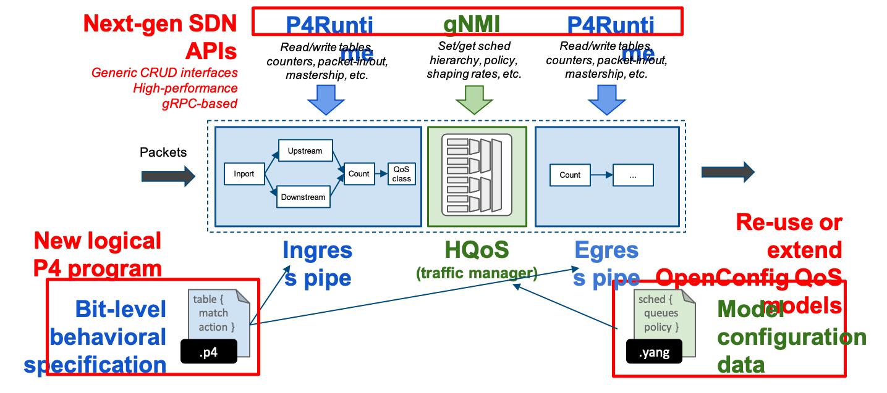
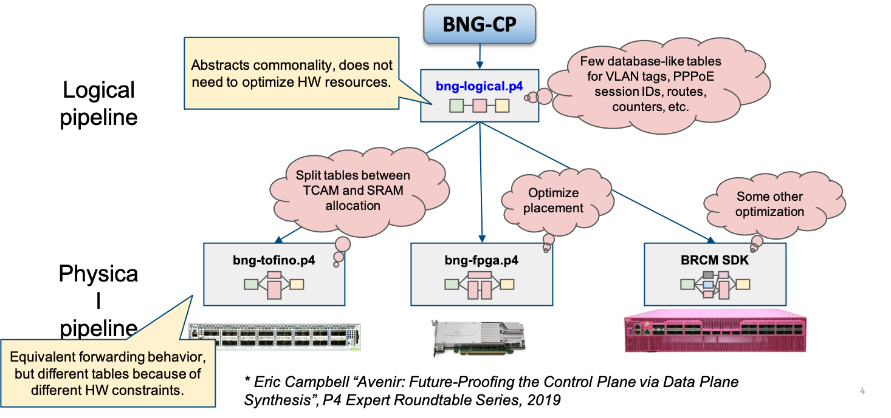
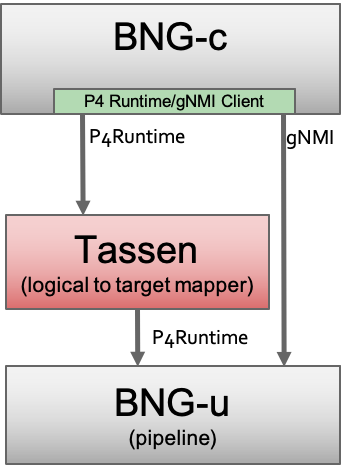
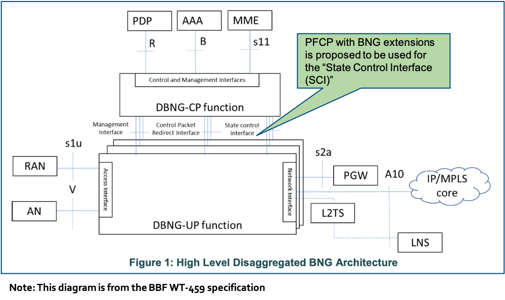
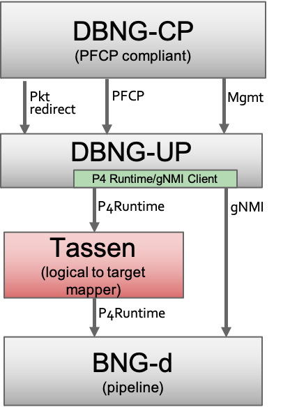

************
Architecture
************

* P4 description of a silicon independent pipeline (bng.p4)

* P4Runtime interface derived from P4 description

* Translation layer (mapr) -> from silicon independent to silicon dependent (e.g., Tofino) or other target (fpga, smartNIC)

  * Northbound: P4Runtime, communicates with the BNG Control Plane

  * Southbound: P4Runtime or other control plane protocol, dialogue with BNG Data Plane

* Integration with current CUPS api (PFCP)

The proposed architecture tackles requirements one by one:
* Arguing and understanding requirements is much easier with formal P4 pipeline
* New requirement == patch to P4 code and corresponding PTF test
* Translation layer
* P4Runtime -> gRPC. Mapr: almost stateless, golang, can horizontally scale
* PTF, fuzz testing with p4pktgen

High Level Architecture
=======================

Tassen and the BBF Disaggregated BNG Architecture (WT-459)
==========================================================

Sequence Diagrams
=================

Initial pipeline setup
~~~~~~~~~~~~~~~~~~~~~~

.. uml::

  @startuml
  "BNG-c" -> Tassen: gNMI multiple sets to init device
  Tassen -> device: gNMI set calls
  "BNG-c" -> Tassen: P4RT setForwardingPipeline(log_p4info, phy_p4info, phy_bng.bin)
  Tassen -> device: P4RT setForwardingPipeline(phy_p4info, phy_bng.bin)
  @enduml

Write BNG tables
~~~~~~~~~~~~~~~~

.. uml::

  @startuml
  "BNG-c" -> Tassen: P4RT write: log_table
  Tassen -> Tassen: translate to phyiscal write
  Tassen -> device: P4RT write: phy table
  @enduml

Read BNG tables
~~~~~~~~~~~~~~~

.. uml::

  @startuml
  "BNG-c" -> Tassen: P4RT read: log_table
  Tassen -> Tassen: translate to phyiscal read
  Tassen -> device: P4RT read: phy table
  Tassen <- device: P4RT resp: phy table data
  Tassen <- Tassen: translate to logical read
  "BNG-c" <- Tassen: P4RT resp: log table data
  @enduml

