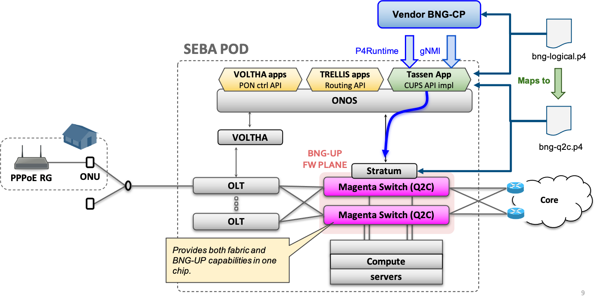
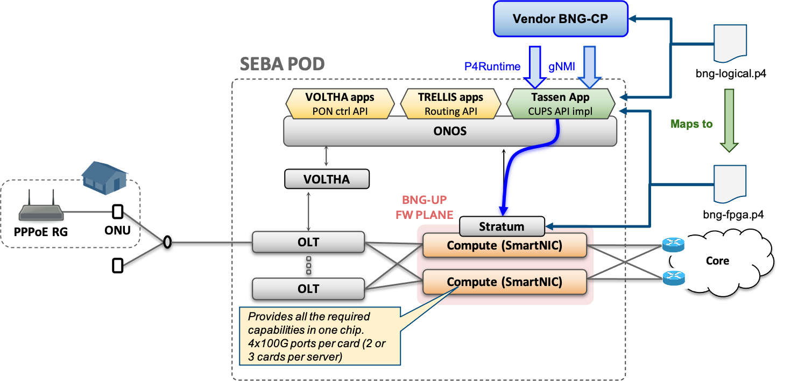

*********
Use Cases
*********

BNG
===

* high level pipeline description (block level)

* Talk about design rationale behind logical bng.p4 (few database-like tables)

* high level description of a target pipeline

* description of the mapping of some functionalities

UP4
===

(SAME AS IN BNG?)
Carmelo: worth of mention as the physical realization comprises downlink buffering as an off-device component, but abstracted as an action in the pipeline.

